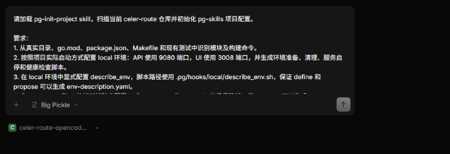
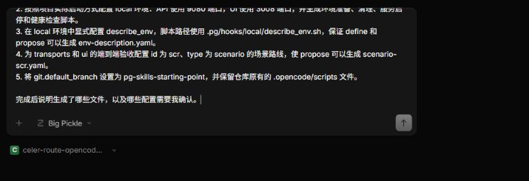
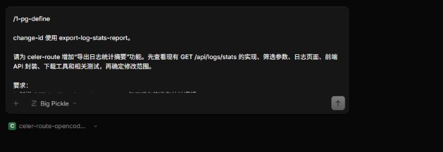
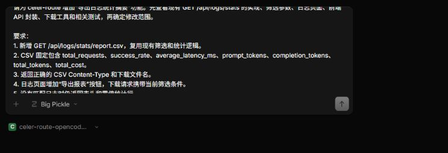
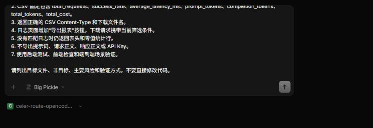
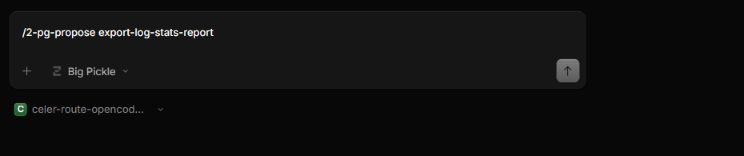
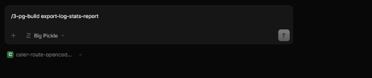
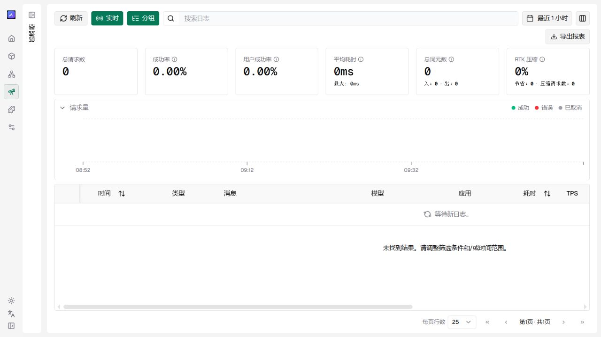

# 在 celer-route 中体验 pg-skills

pg-skills 是一套面向 AI 编程的开发工作流。它把需求定界、方案生成、代码实现和验证合并拆成可检查的步骤，并把关键产物保存在项目中。

**标准流：define → propose → build → verify → merge**

| 阶段 | OpenCode 命令或 Skill | 主要产物 |
| --- | --- | --- |
| 定界需求 | `/1-pg-define`、`pg-define` | `define-summary.yaml`、`env-description.yaml` |
| 生成提案 | `/2-pg-propose <change-id>`、`pg-propose` | `proposal.md`、`design.md`、`tasks.md`、`execution-manifest.yaml` 和验收场景 |
| 构建实现 | `/3-pg-build <change-id>`、`pg-build` | 业务代码、测试和 `2-build/` 运行记录 |
| 验证合并 | `pg-verify-and-merge`（由 build 自动触发） | 验证已归档的变更，并把功能分支合并到默认分支 |

**SEA（Spec、Environment、Acceptance）是 pg-skills 的方法论。** 它要求方案、真实环境和验收条件相互对应：

| 支柱 | 对应产物 | 作用 |
| --- | --- | --- |
| **方案 Spec** | `proposal.md`、`design.md`、`tasks.md` | 说明为什么做、怎样实现以及分成哪些任务 |
| **环境 Environment** | `env-description.yaml` | 由 `describe_env` 只读探测生成，记录本次变更使用的真实环境 |
| **验收 Acceptance** | `scenario-*.yaml`（Gherkin 场景） | 定义可执行的验收条件，并通过实际运行结果证明功能符合方案 |

本教程会从一个尚未接入 pg-skills 的 celer-route 分支开始，完成“导出日志统计报表”功能。完成后，日志页面可以根据当前筛选条件下载 CSV 统计摘要。

## 阅读说明

本文有两种输入：

- 标注为 PowerShell 的命令在项目根目录的终端中执行；
- `/*-pg-*` 命令和任务描述发送到 OpenCode 对话框。

斜杠命令不是终端命令。

## 第一步：准备项目

### Fork 仓库并获取代码

标准 build 会创建并推送功能分支，随后把验证通过的结果合并、推送到配置的默认分支。因此，开始前先在 GitHub 上 Fork `pin-gou/celer-route`。本教程仍从官方仓库克隆指定的教学分支，再把自己的 Fork 配置为可写的 `origin`，这样既能确保起点一致，也能完成后续推送。

在 PowerShell 中执行，其中 `<你的账号>` 替换为自己的 GitHub 用户名：

```powershell
git clone --branch pg-skills-starting-point --single-branch https://github.com/pin-gou/celer-route.git
cd celer-route
git remote rename origin upstream
git remote add origin https://github.com/<你的账号>/celer-route.git
git push -u origin pg-skills-starting-point
git branch --show-current
python --version
go version
node --version
opencode --version
```

当前分支应显示 `pg-skills-starting-point`，`origin` 指向自己的 Fork，`upstream` 指向官方仓库。仓库 `.nvmrc` 声明 Node.js `22.12.0`，Go 版本建议与项目 `go.mod` 一致。OpenCode 还应提前配置好可用的模型 Provider。

### 安装并加载 pg-skills

将 pg-skills 安装到项目，并生成 OpenCode 能够识别的命令和 Agent：

```powershell
git remote add pg-skills https://github.com/pin-gou/pg-skills.git
git fetch pg-skills --tags
git subtree add --prefix=.pg/skills pg-skills v0.9.2 --squash
python .pg\skills\src\runtime\bin\pg init --tool opencode
```

安装完成后：

- `.pg/skills/` 保存 pg-skills 的公共工作流；
- `.opencode/` 保存 OpenCode 使用的命令和 Agent；
- `.pg/tool-integration.json` 记录当前使用的开发工具。

### 生成项目配置

在项目根目录启动 OpenCode：

```powershell
opencode
```

在 OpenCode 中发送：

```text
请加载 pg-init-project skill，扫描当前 celer-route 仓库并初始化 pg-skills 项目配置。

要求：
1. 从真实目录、go.mod、package.json、Makefile 和现有测试中识别模块及构建命令。
2. 按照项目实际启动方式配置 local 环境：API 使用 9080 端口，UI 使用 3008 端口，并生成环境准备、清理、服务启停和健康检查脚本。
3. 在 local 环境中显式配置 describe_env，脚本路径使用 .pg/hooks/local/describe_env.sh，保证 define 和 propose 可以生成 env-description.yaml。
4. 为 transports 和 ui 的端到端验收配置 id 为 scr、type 为 scenario 的场景路线，使 propose 可以生成 scenario-scr.yaml。
5. 将 git.default_branch 设置为 pg-skills-starting-point，并保留仓库原有的 .opencode/scripts 文件。

完成后说明生成了哪些文件，以及哪些配置需要我确认。
```





初始化主要生成两类配置：`.pg/project.yaml` 记录模块、环境、工作路线和构建命令；`.pg/hooks/` 保存环境准备、清理、服务启停、健康检查和 `describe_env` 只读探测脚本。`.opencode/` 中的命令入口用于在 OpenCode 中加载对应工作流。

`pg-init-project` 完成后，项目已经可以进入 define 阶段。下面的检查不是工作流的必经步骤；本教程为了确认刚生成的配置符合后续场景验收要求，才进行一次额外核对。

### 可选：检查初始化结果

需要排查配置问题或核对本教程的关键配置时，在 PowerShell 中运行：

```powershell
python .pg\skills\src\runtime\bin\pg doctor
Test-Path .pg\hooks\local\describe_env.sh
Select-String -Path .pg\project.yaml -Pattern 'describe_env|scr:|type: scenario|default_branch'
```

`pg doctor` 检查项目配置是否符合 Schema，并提示未完成的占位配置；`Test-Path` 确认本教程需要的 `describe_env` 脚本已经生成；`Select-String` 只用于显示需要人工核对的配置行。检查结果中，`pg doctor` 应没有 `error` 或 `placeholder`，`Test-Path` 应返回 `True`，配置查询结果应包含 `describe_env`、`scr`、`type: scenario` 和 `default_branch`。

`describe_env` 只读取服务地址、可用能力和数据状态，不启动服务或修改数据。define 和 propose 会使用它生成的 `env-description.yaml` 判断验收条件能否在 local 环境中执行。

### 首次接入时保存配置

这也不是 define 的前置步骤。如果 pg-skills 配置已经提交到仓库，可以直接跳过。本教程刚刚在教学分支上完成首次接入，因此先提交生成的配置，避免后续 build 因工作区存在未提交内容而中断：

```powershell
git add .pg .opencode
if (Test-Path pg-run) { git add pg-run }
if (Test-Path pg-run.cmd) { git add pg-run.cmd }
git commit -m "chore: integrate pg-skills for OpenCode"
```

以上检查和提交都不构成新的 pg-skills 阶段。准备完成后，重新启动 OpenCode，输入 `/` 应能看到 `1-pg-define`、`2-pg-propose` 和 `3-pg-build`，随后即可进入 define。

## 第二步：明确报表需求

### 功能目标

celer-route 已经提供日志查询和统计接口。本次练习在现有能力上增加一份 CSV 格式的统计摘要：

1. 后端新增 `GET /api/logs/stats/report.csv`；
2. 报表复用现有日志筛选和统计逻辑；
3. CSV 包含请求数、成功率、平均延迟、Token 数和总费用；
4. 日志页面增加“导出报表”按钮，并携带页面当前的筛选条件；
5. 报表不包含提示词、请求正文、响应正文或 API Key；
6. 后端测试、前端检查和端到端场景均通过。

pg-skills 使用 change-id 组织一次变更的提案产物、代码和运行记录。本次使用：

```text
export-log-stats-report
```

### 使用 define 完成定界

在 OpenCode 中一次发送以下完整内容。`/1-pg-define` 后面的正文就是本次定界任务，不要拆成两次发送：

```text
/1-pg-define

change-id 使用 export-log-stats-report。

请为 celer-route 增加“导出日志统计摘要”功能。先查看现有 GET /api/logs/stats 的实现、筛选参数、日志页面、前端 API 封装、下载工具和相关测试，再确定修改范围。

要求：
1. 新增 GET /api/logs/stats/report.csv，复用现有筛选和统计逻辑。
2. CSV 固定包含 total_requests、success_rate、average_latency_ms、prompt_tokens、completion_tokens、total_tokens、total_cost。
3. 返回正确的 CSV Content-Type 和下载文件名。
4. 日志页面增加“导出报表”按钮，下载请求携带当前筛选条件。
5. 没有匹配日志时仍返回表头和零值统计行。
6. 不导出提示词、请求正文、响应正文或 API Key。
7. 使用后端测试、前端检查和端到端场景验证。

请列出目标文件、非目标、主要风险和验证方式，不要直接修改代码。
```







define 给出定界总结后，选择 `local` 环境并确认执行定界后的环境验证。该环节会调用只读的 `describe_env` 脚本，生成环境描述和定界结果。

### 定界后的选择

环境验证通过后，OpenCode 会依次询问：

1. 是否继续细化真实环境的验证方法；
2. 下一步进入 propose、quick-build，还是直接实施。

本次功能涉及后端接口、前端页面和场景验收，应选择 **“加载 pg-propose skill 生成产物（推荐）”**。选择后，OpenCode 会在当前对话中直接进入 propose，不需要再次输入命令。如果希望手动进入该阶段，也可以输入 `/2-pg-propose export-log-stats-report`。

define 完成后会生成：

| 文件 | 作用 |
| --- | --- |
| `0-define/define-summary.yaml` | 保存本次需求的目标、范围、非目标、风险和验证方式 |
| `env-description.yaml` | 保存 `describe_env` 对当前项目环境的只读探测结果，供 propose 和 build 使用 |

`define-summary.yaml` 应说明：后端修改位于日志处理器，前端修改位于日志页面和 API 封装，现有统计逻辑会被复用，原始日志内容不属于导出范围。

## 第三步：生成变更提案

### 使用 propose

如果 define 结束时已经选择推荐的 propose 路径，可以直接等待提案生成。否则在 OpenCode 中输入：

```text
/2-pg-propose export-log-stats-report
```



propose 会根据 define 的定界结果生成变更提案。完成后，变更目录中会包含：

```text
.pg/changes/export-log-stats-report/
├── 0-define/
│   └── define-summary.yaml
├── env-description.yaml
├── proposal.md
├── design.md
├── tasks.md
├── execution-manifest.yaml
├── scenario-scr.yaml
└── 1-propose-review/
    └── on-conditions-eval.md
```

### 提案产物

| 文件 | 作用 |
| --- | --- |
| `proposal.md` | 说明为什么做、要达到什么结果 |
| `design.md` | 说明后端接口和前端按钮怎样实现 |
| `tasks.md` | 把实现过程拆成可以执行的步骤 |
| `execution-manifest.yaml` | 把任务整理成 build 实际执行的工作清单 |
| `env-description.yaml` | 记录本次任务使用的真实项目环境 |
| `scenario-scr.yaml` | 从日志页面点击下载开始，验收完整功能 |

场景验收路线统一命名为 `scr`。由于本次变更同时涉及后端接口和前端页面，propose 会生成 `scenario-scr.yaml`，并在 `on-conditions-eval.md` 中记录启用原因。

### SEA 与本次变更

pg-skills 使用 **SEA** 让提案、环境和验收相互对应：

| SEA | 本次练习中的内容 |
| --- | --- |
| Spec | `proposal.md`、`design.md`、`tasks.md` 说明要做什么、怎样实现 |
| Environment | `env-description.yaml` 说明在哪个真实环境中执行 |
| Acceptance | `scenario-scr.yaml` 和测试结果说明功能是否真正完成 |

SEA 要求提案产物能够在当前项目环境中执行，并通过测试或场景结果证明功能可用。

### 核对提案产物

进入 build 前，重点确认：

1. `design.md` 复用了现有日志筛选和统计能力；
2. 任务同时包含后端接口、前端按钮和必要测试；
3. 场景会验证筛选参数、下载响应头和 CSV 内容。

确认提案产物正确后，在 PowerShell 中保存这些文件：

```powershell
git add .pg\changes\export-log-stats-report
git commit -m "docs: record log stats report plan"
```

## 第四步：执行 build

### 运行完整工作流

在 OpenCode 中输入：

```text
/3-pg-build export-log-stats-report
```



build 会直接读取已经生成的提案产物和任务，不需要再次发送需求。它会依次完成代码修改、测试、代码审查和场景验证，并把过程记录在本次 change 中。流水线成功后，build 会先把 change 自动归档到 `.pg/changes/archive/`，再自动触发 `pg-verify-and-merge` 验证并合并功能分支；不需要手动输入 `pg-verify-and-merge`。

build 完成后可以查看：

| 产物 | 作用 |
| --- | --- |
| 业务代码 | 实现 CSV 报表接口、前端下载请求和“导出报表”按钮 |
| 测试 | 验证统计复用、CSV 内容、空结果和筛选参数传递 |
| `2-build/` | 保存各阶段的执行记录、测试报告、场景结果和验证证据 |

验证通过后，`pg-verify-and-merge` 会把功能分支合并、推送到配置的默认分支。归档由 build 在触发该流程前完成。

## 第五步：查看最终结果

### 检查报表功能

完成后，日志页面应出现“导出报表”按钮。点击后下载的 CSV 应满足：

- 使用页面当前的筛选条件；
- 包含约定的七个统计字段；
- 没有数据时仍有表头和零值统计行；
- 不包含日志正文和密钥。

### 验证代码与场景结果

在 PowerShell 中执行：

```powershell
go -C transports/celer-route-http test ./handlers -run 'Test(FormatLogStatsCSV|GetLogsStatsReportCSV|ParseLogStatsFiltersMatchesGetLogsStats)' -count=1

Push-Location ui
npx vitest run app/workspace/logs/views/exportLogStatsReportButton.test.tsx
Pop-Location

npm --prefix ui run typecheck
npm --prefix ui run lint
git show --stat --oneline HEAD
Get-ChildItem .pg\changes -Recurse -Filter '*-evidence.json' -File |
  Sort-Object LastWriteTime -Descending |
  Select-Object -First 1 -ExpandProperty FullName
```

后端命令只运行本次报表功能对应的测试，Vitest 命令验证“导出报表”按钮，随后执行前端类型检查和 lint。当前仓库的 lint 可能显示既有 warning；退出码为 0 且结果为 `0 errors` 即表示 lint 通过。`git show` 显示本次提交的修改范围。最后一组命令输出最新场景证据文件的完整路径；打开该 JSON 文件，确认页面操作、下载请求和 CSV 断言均已通过。该文件是 SEA 中 Acceptance 的实际验收证据。代码、测试和场景结果一致时，本次练习就完成了。

## 完成后的页面

完成后，日志页面会显示“导出报表”按钮。点击该按钮即可按当前筛选条件下载日志统计 CSV。



## 后续学习

本教程已经完成 define、propose 和 build 标准流程。接下来可以尝试其他工作流：

| 工作流 | OpenCode 命令 | 适用场景 |
| --- | --- | --- |
| 需求压力测试 | `/1-pg-grill` | 检查需求或方案中的遗漏和矛盾 |
| 快速构建 | `/2b-pg-quick-build` | 小范围、边界明确的修改 |
| 回归测试 | `/4-pg-regression` | 执行项目已有的回归测试套件 |
| 问题修复 | `/5-pg-fix-issue` | 修复已经确认且可以复现的问题 |
| 手动归档 | `/6-pg-archive <change-id>` | 归档失败、取消或不再继续的变更 |

进一步阅读：

- [工作流选择](../workflows.md)：比较标准开发、快速构建、回归测试、问题修复和归档流程。
- [命令参考](../commands.md)：查看各命令的参数、输入和产物。
- [项目配置](../configuration.md)：了解 modules、environments、tracks 和 stages。
- [项目目录与产物](../project-structure.md)：了解 `.pg/` 与工具适配目录的用途。

遇到初始化、命令加载或工作流中断时，查看[故障排查](../troubleshooting.md)。
